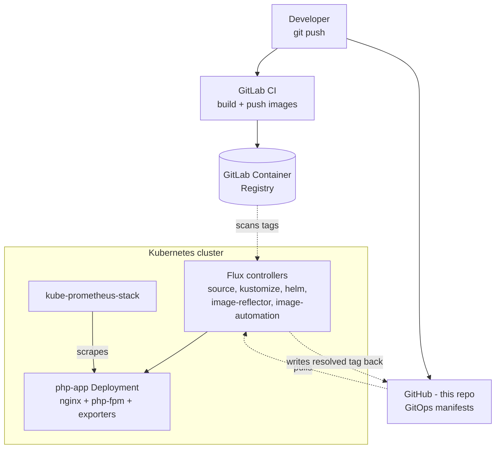
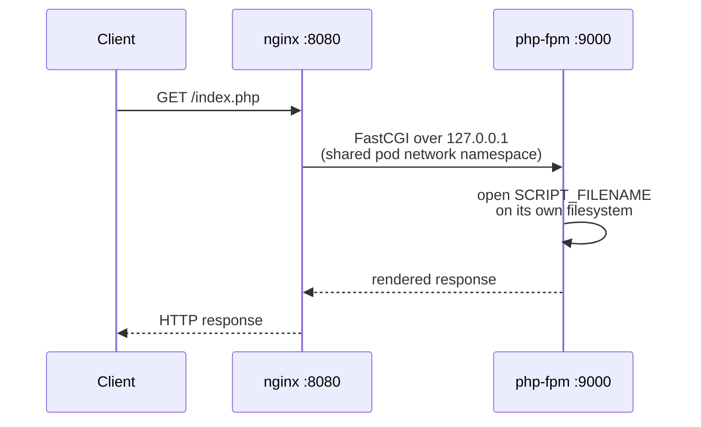

# php-gitops-lab

A GitOps delivery pipeline for a small PHP-FPM + nginx app: GitLab CI builds
and pushes images, Flux pulls them into a Kubernetes cluster and reconciles
the Git state, and kube-prometheus-stack watches the result. Built to learn
every failure mode of each piece well enough to debug it live - see
[`drills/`](drills/) for the break-and-fix catalog.

## Status (2026-10-09)

Live and verified end to end against a real single-node kubeadm cluster:
Flux is bootstrapped, kube-prometheus-stack is running, and a real
GitLab CI pipeline has built and pushed both images. The full loop has
been observed to close with no manual intervention - CI build, registry
scan, tag resolution, Git commit, Helm upgrade, and a running pod serving
real HTTP responses - see "What's been proven live" below. No drill has
been run yet; the `drills/` catalog is still a to-do list. This is a
single-node lab, not a production claim.

### What's been proven live

Full trace, one real run, no step skipped or faked:

1. `git push` to GitHub with an app change
2. GitLab CI (`lint` -> `test` -> `build` -> `push`) built both images and
   pushed them to the GitLab Container Registry with a sortable tag
3. Flux's `ImageRepository` scanned the registry and found the new tag
4. `ImagePolicy` resolved it as latest
5. `ImageUpdateAutomation` committed the resolved tag into
   `apps/php-app/helmrelease.yaml` on GitHub automatically, authored by
   Flux's own bot identity, `[ci skip]` in the message
6. The `apps` Kustomization picked up that commit
7. `helm-controller` ran the upgrade - `HelmRelease` went `Ready: True`
8. The Deployment rolled out 2/2 pods, `Running`, images pulled clean
9. A pod inside the cluster `curl`ed the Service and got the real page back

### Known operational issue

CoreDNS on this host has broken three separate times during this build,
always the same mechanism: `/etc/resolv.conf` inside each CoreDNS pod is
set once at pod creation from the node's resolver file at that moment, and
never updates again. When the host's network changes (different Wi-Fi, VPN
on/off), CoreDNS keeps forwarding to resolvers that are no longer correct
for the current network, and DNS inside the cluster dies - including for
Flux and image-automation, since both depend on resolving GitHub and
GitLab. Fix each time was `kubectl -n kube-system rollout restart
deployment coredns`, which forces new pods to pick up the current
`/run/systemd/resolve/resolv.conf`. This is a host/cluster issue, not a
bug in anything this repo defines - worth a small watchdog if it keeps
recurring.

## Why GitHub here and GitLab CI in the pipeline

This repository (the Git source Flux reads, and where `ImageUpdateAutomation`
commits back) is hosted on GitHub. The CI pipeline (`.gitlab-ci.yml`) and the
container registry are GitLab's, pushed to a separate GitLab project
(`gitlab.com/adam.bouafia/php-gitops-lab`) that mirrors this one so the
pipeline has something to actually run against - GitLab CI only executes for
repositories it can see. Flux never talks to GitLab directly except to pull
images from its registry.

## Architecture



CI never touches the cluster - it stops at the registry. Everything inside
the cluster **pulls**: Flux pulls Git and the registry, so the cluster needs
no CI credentials, and Git stays the single source of truth for what is
deployed.

## The pipeline, hop by hop

```mermaid
flowchart LR
    A["git push<br/>app code"] --> H1
    H1["1. GitLab CI<br/>build + push images"] --> H2["2. Registry<br/>holds new tag"]
    H2 --> H3["3. ImageRepository<br/>scans registry"]
    H3 --> H4["4. ImagePolicy<br/>picks latest tag"]
    H4 --> H5["5. ImageUpdateAutomation<br/>commits tag to Git"]
    H5 --> H6["6. GitRepository<br/>Flux pulls commit"]
    H6 --> H7["7. Kustomization<br/>applies manifests"]
    H7 --> H8["8. HelmRelease<br/>helm upgrade"]
    H8 --> H9["9. Deployment<br/>nginx + php-fpm pods"]
    H9 --> H10["10. Service<br/>Ready endpoints"]
    H10 --> H11["11. ServiceMonitor<br/>Prometheus target"]
    H11 --> H12["12. PrometheusRule<br/>alert evaluation"]
```



Every problem in this lab lives at exactly one hop; `drills/` and the
debugging notes below are organized around naming that hop first.

## Two containers, one pod



nginx serves static files and forwards `*.php` requests to php-fpm over
FastCGI on the loopback interface - same pod, shared network namespace.
`nginx`'s `root` and php-fpm's view of the code must resolve to the same
path, because `SCRIPT_FILENAME` is a path php-fpm opens on its own
filesystem. Drill 9 breaks exactly this.

## Repo layout

```text
php-gitops-lab/
  app/                    PHP source, nginx + php-fpm Dockerfiles, configs
  charts/php-app/         Helm chart: Deployment (4 containers), Service,
                           ServiceMonitor, PrometheusRule, values.schema.json
  .gitlab-ci.yml          lint -> test -> build -> push
  clusters/utopia/        Flux Kustomization entrypoints (flux-system/ is
                           generated by `flux bootstrap`, not hand-authored)
  infrastructure/         kube-prometheus-stack HelmRelease + HelmRepository
  apps/php-app/           HelmRelease for the app (setter-marked image tags)
  image-automation/       ImageRepository, ImagePolicy, ImageUpdateAutomation
  drills/                 break-and-fix catalog, one write-up per drill
```

## Key design decisions

- **Pull, not push.** CI's job ends at the registry. Flux inside the
  cluster pulls Git and the registry, so the cluster never holds CI
  credentials.
- **Why image automation writes back to Git.** If Flux only patched the
  Deployment in-cluster, Git would say one tag and the cluster another.
  The automation commit keeps Git the record of what is actually deployed,
  with one commit per release.
- **Sortable tags.** Tags are `main-<short-sha>-<pipeline-iid>`. `latest`
  or a bare SHA doesn't sort, so `ImagePolicy` couldn't pick a "latest".
- **Setter markers.** `ImageUpdateAutomation` only rewrites lines carrying
  a `{"$imagepolicy": "..."}` comment (see `apps/php-app/helmrelease.yaml`).
  No marker means no update - and no error either (drill 2).
- **The CI-loop risk.** The automation's own commit back into this repo
  must not retrigger a build. Handled twice here: `[ci skip]` in the
  commit template, and `.gitlab-ci.yml`'s `rules: changes: app/**/*`
  (drill 16).
- **Two credentials, two places.** Flux's scan credential
  (`ImageRepository.spec.secretRef`) and the kubelet's `imagePullSecret`
  are separate - one working says nothing about the other (drills 4, 5).
  See `image-automation/README.md`.
- **Drift.** A Kustomization reapplies its manifests every interval and
  reverts manual edits; a HelmRelease only does the same if
  `spec.driftDetection.mode: enabled` is set (drill 7).
- **ServiceMonitor selection.** kube-prometheus-stack's Prometheus only
  picks up ServiceMonitors/PrometheusRules carrying
  `release: kube-prometheus-stack` (drill 13), and `endpoints[].port`
  is the Service port *name*, not the number.

## Quickstart

Target is the existing single-node kubeadm cluster on this machine (node
`utopia`), not a throwaway `kind` cluster - no separate cluster-create step.

```bash
# 1. Bootstrap Flux - generates clusters/utopia/flux-system/ and needs write
#    access because image-automation pushes commits back here
flux bootstrap github \
  --owner=adam-bouafia --repository=php-gitops-lab \
  --branch=main --path=clusters/utopia --personal --read-write-key

# 2. Create the two registry secrets - see image-automation/README.md

# 3. Watch it reconcile
flux get all -A
```

Hardware note: this machine runs everything on one host with no swap -
the kubeadm cluster itself, kube-prometheus-stack, VS Code, and a browser
can exhaust 16GB together. `infrastructure/kube-prometheus-stack.yaml`
already trims retention, resource requests, and disables components not
used here (Alertmanager with no receiver, node-exporter, Grafana) - see the
comments in that file before re-enabling anything for a demo. Check
`free -m` before reconciling the infrastructure Kustomization.

## Drills

`drills/` is a catalog of deliberate failures, one per pipeline hop, each
written up as detection -> diagnosis -> root cause -> fix -> prevention.
See [`drills/README.md`](drills/README.md) for the full list and status.
